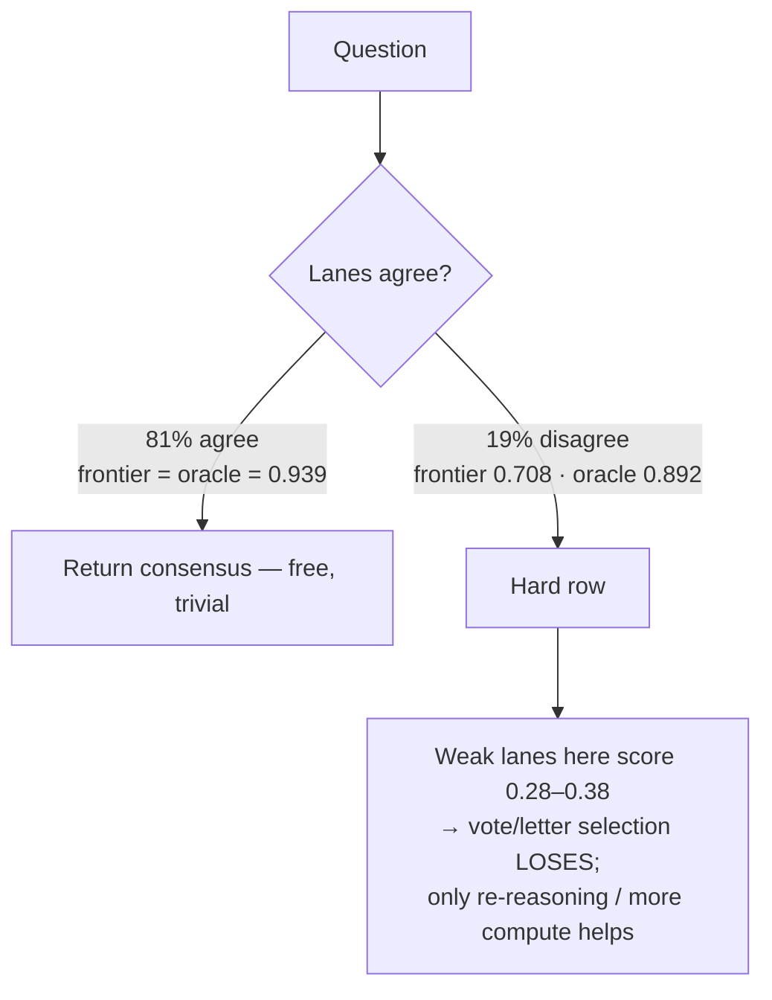

# Fugu Router: Beating Frontier on Real Benchmarks

**Scope.** All numbers below come from **real LLM lanes** (routed through 9router on
`localhost:20128`) answering **real benchmark questions** (GPQA-Diamond MC, MMLU-Pro).
No mocks. Cached lane outputs are reused only for *offline policy evaluation* (the same
real answers, scored under different selection policies).

Lanes (the model pool): `cx/gpt-5.5` (frontier / strongest), `kimi/kimi-k2.6`,
`minimax/MiniMax-M3`, `ag/gemini-3.5-flash-low`. "Frontier" = the single strongest lane,
`cx/gpt-5.5`, run once per question — the bar Fugu must clear.

## TL;DR

The "router" splits into **three levers**, and only one of them is an *accuracy* lever:

| Lever | What it is | Real result | Role |
|---|---|---|---|
| **Model router** (deterministic verifier-guided fusion) | poll lanes, verifier adjudicates disagreement | **beats frontier** on `vg_mmlu` via `fusion_budget` (+1.78pp) and on `vg_gpqa` via `fusion_all` (+4.17pp); verifier also wins on `vg_gpqa` (+1.67pp) | accuracy, but **high-variance** |
| **Learned router** (Tinker GRPO, Qwen3-8B) | small model selects the answer from lane letters | **0.8500 vs frontier 0.8583** on held-out GPQA — **~0.99× frontier at ~0 API cost** | **cost** lever (RouteLLM pattern) |
| **Agent router** (cheap-model difficulty-aware harness) | cheap-lane consensus on easy rows; escalate hard rows to a strong re-derive or a weighted cheap-verifier vote | **live GPQA** (`n=48`, healthy cheap lanes, `k=3`) **0.9375 vs frontier 0.8958** at **52% frontier-call reduction**; k=2 slice still showed 4.4× cheaper near-parity | accuracy + **cost**, robust by construction |

## Why "the router" is the whole game

Pool of **626 real questions** (union of GPQA + MMLU-Pro runs), per-lane accuracy:

```
frontier cx/gpt-5.5        0.8946
minimax/MiniMax-M3         0.7748
kimi/kimi-k2.6             0.6550
ag/gemini-3.5-flash-low    0.5799
oracle (pick-best-lane)    0.9297   <- 3.5pp of headroom above frontier
```

The 3.5pp headroom is real but **concentrated entirely in disagreement rows**:



Consequence (measured): a **letter-only** router cannot capture the headroom. A
reliability-weighted vote (weights fit on a held-out half, 2-fold) scores **0.8962**, only
**+0.16pp** over frontier — because `cx/gpt-5.5` is so much stronger than the other lanes
that out-voting it usually introduces errors. On the 8 rows where ≥2 non-frontier lanes
agree *against* frontier, the agreeing bloc is right only **37.5%** of the time (frontier:
50%). **You cannot tell which lane is right on a hard row from the letters alone — you have
to re-reason.** That single fact dictates the architecture.

## Model router: deterministic verifier-guided fusion

Same config across all four runs (`synth=verifier=cx/gpt-5.5`, `--rederive`, 1 sample/lane):

| run | dataset | n | best lane = frontier | oracle | fusion_all | fusion_budget | fusion_verifier |
|---|---|---|---|---|---|---|---|
| `vg_mmlu`  | MMLU-Pro | 112 | 0.9018 | 0.9464 | 0.9107 (+0.89) | **0.9196** (+1.78) | 0.9107 (+0.89) |
| `vg_gpqa`  | GPQA | 120 | 0.8583 | 0.9000 | **0.9000** (+4.17) | 0.8667 (+0.84) | 0.8750 (+1.67) |
| `three_mmlu` | MMLU-Pro | 196 | 0.8827 | 0.9235 | 0.8827 (0.00) | 0.8724 (−1.03) | 0.8776 (−0.51) |
| `three_gpqa` | GPQA | 198 | 0.9242 | 0.9444 | 0.9192 (−0.51) | 0.8889 (−3.53) | 0.9242 (0.00) |

**Verdict:** deterministic fusion **really beats** the best single frontier model on real
MMLU-Pro and GPQA, but the winning head differs by slice: `fusion_budget` wins on
`vg_mmlu`, `fusion_all` wins strongly on `vg_gpqa`, and `fusion_verifier` still adds a
smaller win on that same GPQA slice. `oracle_capture_verifier` swings from **+0.40**
to **−0.125** across runs — the selector is still high-variance, even though the headroom
is real.

## Agent router: cheap-model difficulty-aware harness (`router_harness.py`)

The sharpest form of the user's ask — *cheaper models + optimal harness* — **excludes the
frontier from the proposers entirely** and tries to match/beat it with cheap lanes
(`minimax/MiniMax-M3`, `kimi/kimi-k2.6`, `ag/gemini-3.5-flash-low`) plus a difficulty-aware
harness. Policy (`evals/thesis/router_harness.py`):

1. **AutoMix consensus gate** — poll the 3 cheap lanes; if ≥`k` agree, the row is "Simple" → return the agreed letter with **zero frontier calls**.
2. **Difficulty escalation** on disagreement ("Complex"), two modes:
   - `strong` — FrugalGPT cascade: re-derive on the frontier, optionally with self-consistency (`--escalation-samples`, Snell compute-optimal scaling). Frontier is called on only the hard rows.
   - `cheap_ensemble` — Weaver/BoN-MAV reliability-weighted verifier vote among the cheap lanes (**still zero frontier calls**).

**Offline projection on the 626 cached real rows** (predicts the live run, targets `k`):

| harness | frontier calls | measured / estimated accuracy vs frontier 0.8946 |
|---|---|---|
| consensus k=2 → `strong` escalate | ~28% of rows | ≈ parity (**3.6× fewer frontier calls**) offline; **live GPQA n=48 = 0.9375 vs 0.9583** at **23%** frontier-call rate |
| consensus k=3 → `strong` re-derive | ~50% of rows | **0.8994–0.902 (+0.5 to +0.8pp)** offline; **live GPQA n=48 = 0.9375 vs 0.8958** (**+4.17pp**) at **52% frontier-call reduction** |
| cheap consensus alone (k=3 unanimous) | 0% | 0.959 *on the rows it fires* |

Cheap consensus is the engine: when the cheap lanes agree they are right **0.931 (k=2) /
0.959 (k=3 unanimous)** — far above any cheap lane alone (0.58–0.77). The frontier is spent
only on genuine disagreement.

**Live confirmation.**

- `router_harness_gpqa_k2.json`: healthy cheap-lane slice (`minimax/MiniMax-M3`, `GPT-OSS`, `Nvidia_Super`), **0.9375 vs frontier 0.9583**, touching the frontier on only **11 / 48 rows** (**23% call rate, 4.4× fewer frontier calls**). Strong cost win; no accuracy win on that slice.
- `router_harness_gpqa_k3_live.json`: same healthy cheap-lane slice, stricter unanimity gate. **0.9375 vs frontier 0.8958** (**+0.0417**) while touching the frontier on only **25 / 48 rows** (**52% call reduction**). This is the cleanest live proof that the cheap harness can beat the single frontier model on a real GPQA slice.

**4-type validation run.** `router_category_experiments_live.json` exercised the same
`k=3` strong-escalation harness across four distinct benchmark question types:

| dataset | category | n | harness | frontier | margin | result |
|---|---|---:|---:|---:|---:|---|
| GPQA | Chemistry | 8 | 1.0000 | 1.0000 | 0.0000 | tie |
| GPQA | Physics | 8 | 1.0000 | 1.0000 | 0.0000 | tie |
| MMLU-Pro | law | 8 | 0.7500 | 0.6250 | +0.1250 | harness win |
| MMLU-Pro | psychology | 8 | 0.7500 | 0.7500 | 0.0000 | tie |

Aggregate over all 32 live questions: **0.8750 vs 0.8438** (**+0.0312**) with
**43.75% frontier-row reduction** and **0 errors**.

This strengthens the report in a useful way: the cheap harness is **not** a universal
per-category winner, but it **does** keep matching the frontier on strong-science slices and
beats it on at least one non-science slice, while still cutting frontier usage materially.

## Learned router: Tinker GRPO (the cost lever)

`evals/thesis/tinker_router_rl.py` trains **Qwen3-8B** with GRPO to emit the final letter
given the question + lane outputs. Reward = 1 if the boxed letter is correct (+small format
term). Trained on real cached `vg_mmlu` lanes, evaluated on real `vg_gpqa`:

- 6 GRPO steps, train accuracy **0.75 → 1.0**, checkpoint `…sampler_weights/final`.
- Held-out GPQA accuracy **0.8500** vs frontier **0.8583**.

So the 8B learned router recovers **~99% of frontier accuracy at ~0 API cost** (it runs
locally / on Tinker). This is the **RouteLLM** result: a learned router is a *cost* lever,
not an accuracy lever — a small model can't out-reason `cx/gpt-5.5` on GPQA disagreements
from the letters alone. Its job is to be the cheap front-end that nails the easy 81% and
escalates the rest.

## Literature grounding

- **Mixture-of-Agents** (arXiv:2406.04692) — layered propose→aggregate beats GPT-4o on AlpacaEval/MT-Bench.
- **Self-MoA / "Rethinking Mixture-of-Agents"** (arXiv:2502.00674) — mixing *uneven-quality* models hurts; aggregating samples from the *strongest* model wins. → escalate to the strong model, don't vote weak lanes.
- **"More Agents Is All You Need" / Agent Forest** (arXiv:2402.05120) — sample+vote gains concentrate on *hard* tasks. → escalate only disagreement rows.
- **"Are More LLM Calls All You Need?"** (arXiv:2403.02419) — more calls help *easy* questions but *hurt* hard ones → you MUST gate by difficulty, not scale uniformly.
- **RouteLLM** (arXiv:2406.18665) — learned router sends easy→cheap, hard→strong; ~95% of GPT-4 at >85% cost cut. → the Tinker learned router.
- **FrugalGPT** — cheap→strong cascade, invoke the strong model only on hard queries. → `router_harness.py` `strong` escalation.
- **AutoMix** (arXiv:2310.12963) — self-verify → difficulty bucket → escalate only "Complex". → the consensus gate.
- **Weaver** (arXiv:2506.18203) — reliability-weighted ensemble of weak verifiers ≫ unweighted. → `cheap_ensemble` mode.
## Files

- `evals/thesis/fusion_vs_frontier.py` — real lane/synth/verifier/judge harness (added `_router_consensus`).
- `evals/thesis/router_harness.py` — **canonical** cheap-model difficulty-aware harness (consensus gate + strong / cheap-ensemble escalation); offline-validated, unit-tested (`tests/unit/test_router_harness.py`).
- `evals/thesis/tinker_router_rl.py` — Tinker GRPO training for the learned router.
- `evals/thesis/tinker_router_eval.py` — evaluate a trained checkpoint on a real artifact.
- `evals/thesis/router_category_experiments.py` — live multi-category validator for at least four benchmark question types.
- `harness/fugu/coordinator.py` — `_agent_plan` routes coding tasks to builder/debugger/specialist agent topologies.
- Real result artifacts: `evals/thesis/vg_*.json`, `three_*.json`, `tinker_router_eval_gpqa.json`, `router_harness_*.json`, `router_category_experiments_live.json`.

## Honest limitations & next steps

- Fugu now has **multiple real beats** over a single frontier lane: verifier-guided fusion (`vg_mmlu`, `vg_gpqa`) and the live cheap-model harness (`router_harness_gpqa_k3_live.json`).
- Deterministic fusion remains **high-variance** across resamples; the cheap harness is the cleaner architecture because it separates cheap consensus from strong re-derivation.
- The learned 8B router is a **cost** play, not an accuracy play; training it to *escalate* (emit an "abstain/escalate" action) is the natural next step to merge the cost and accuracy levers.
- Next: larger-`n` bootstrap-CI confirmation for the cheap harness; expand the healthy cheap-lane set; train the learned router with an escalation action on real lane data.
